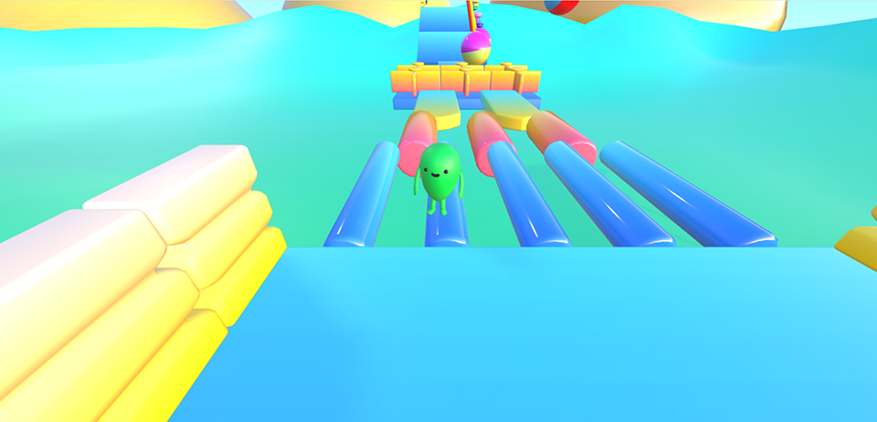

## react-three-egg（蛋仔派对three.js版）

### 项目介绍

  

利用`react` + `threejs`技术栈构建的第三人称Q版闯关类游戏

### 操作

行走：`↑` / `↓` / `←` / `→`（方向键）  

跳跃：`空格`

### 技术栈
- `react`
- `three`
- `@react-three/fiber` 
- `@react-three/rapier`

> **说明：**  
> 
> 本项目源码并非本人开发，原作者信息如下  
> 
> 本仓库在源代码基础上，去除了多人（WebRTC）逻辑，更换为`vite`，简化了部分代码逻辑，并适量提高代码可读性。供大家入门学习。开源不易，感谢大家多多star⭐⭐⭐
> 
> [GitHub主页](https://github.com/wiledal)  
>
> [原作者codesandbox](https://codesandbox.io/u/wiledal)  
>
> [原项目在线地址](https://codesandbox.io/p/sandbox/trip-fellas-wip-9d4vm9)  

